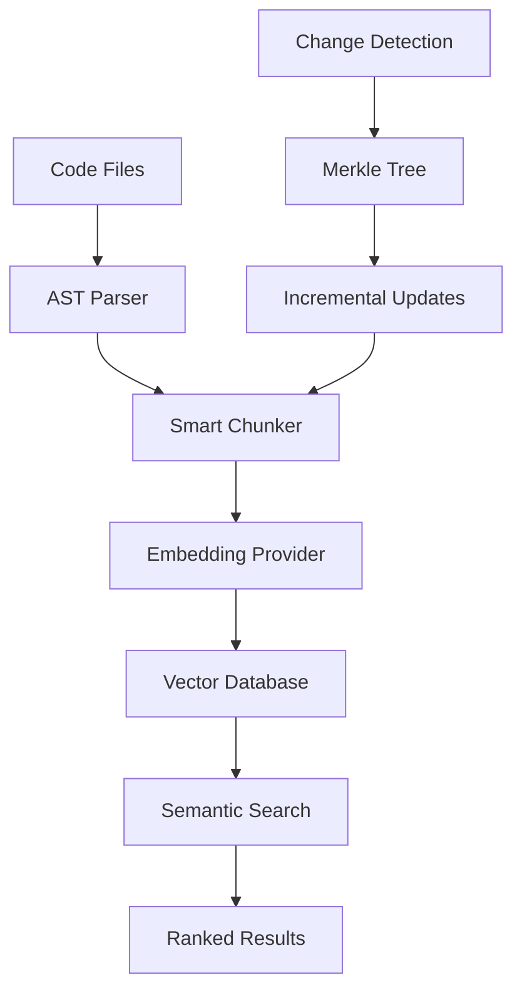

# 🔍 CodeSearch

<div align="center">

**AI-Powered Semantic Code Search & Analysis**

_Transform how you explore and understand codebases with intelligent semantic search_

[](https://www.npmjs.com/package/@codesearch/core)
[](https://www.npmjs.com/package/@codesearch/core)
[](https://github.com/codesearch-ai/codesearch)
[](https://github.com/codesearch-ai/codesearch/fork)

[](https://github.com/codesearch-ai/codesearch/actions)
[](https://codecov.io/gh/codesearch-ai/codesearch)
[](https://opensource.org/licenses/MIT)
[](https://www.typescriptlang.org/)
[](https://nodejs.org/)

[](https://openai.com/)
[](https://qdrant.tech/)
[](https://modelcontextprotocol.io/)
[](https://discord.gg/mKc3R95yE5)

[🚀 Quick Start](#-quick-start) • [📖 Documentation](./docs) • [🎯 Examples](./examples) • [💬 Discord](https://discord.gg/mKc3R95yE5)

</div>

---

## ✨ What is CodeSearch?

CodeSearch is a powerful semantic code search engine that uses AI embeddings to help you find code using natural language queries. Instead of searching for exact text matches, CodeSearch understands the _meaning_ and _context_ of your code, making it incredibly easy to discover relevant functions, patterns, and implementations across large codebases.

### 🎯 Perfect For

- **🔍 Code Discovery**: Find functions, classes, or patterns using natural language
- **📚 Codebase Exploration**: Understand unfamiliar codebases quickly
- **🤖 AI Assistant Integration**: Power your coding assistants with semantic search via MCP
- **🔄 Code Refactoring**: Locate all implementations of specific patterns
- **📖 Documentation**: Generate contextual code documentation

## 🌟 Key Features

### 🧠 **Intelligent Semantic Search**

Search your codebase using natural language queries like "authentication middleware" or "database connection pooling" and get relevant results based on meaning, not just keywords.

### ⚡ **Lightning Fast Indexing**

- **Incremental Updates**: Only re-index changed files using Merkle tree-based change detection
- **Smart Chunking**: AST-based code splitting that preserves context and structure
- **Batch Processing**: Efficient processing of large codebases with progress tracking

### 🌐 **Multi-Language Support**

Full support for:

- **Web**: TypeScript, JavaScript, React, Vue, Angular
- **Backend**: Python, Java, C++, C#, Go, Rust, PHP
- **Mobile**: Swift, Kotlin, Objective-C
- **Data**: SQL, R, Scala
- **Docs**: Markdown, reStructuredText

### 🔌 **Flexible Architecture**

- **Multiple Embedding Providers**: OpenAI, VoyageAI, Gemini, Ollama
- **Vector Database Support**: Qdrant, Faiss (more coming soon)
- **Pluggable Components**: Easily swap providers and databases

### 🛠️ **Multiple Integration Options**

- **📦 Core Library**: Direct integration via npm package
- **🔧 MCP Server**: Model Context Protocol server for AI assistants
- **💻 VSCode Extension**: Native VSCode integration (coming soon)

## 🚀 Quick Start

### Installation

```bash
npm install @codesearch/core
```

### Basic Usage

```typescript
import {
  Context,
  OpenAIEmbedding,
  QdrantVectorDatabase,
} from "@codesearch/core";

// Initialize components
const embedding = new OpenAIEmbedding({
  apiKey: process.env.OPENAI_API_KEY,
  model: "text-embedding-3-small",
});

const vectorDatabase = new QdrantVectorDatabase({
  url: process.env.QDRANT_URL || "http://localhost:6333",
});

const context = new Context({ embedding, vectorDatabase });

// Index your codebase
await context.indexCodebase("./my-project", (progress) => {
  console.log(`${progress.phase} - ${progress.percentage}%`);
});

// Search with natural language
const results = await context.semanticSearch(
  "./my-project",
  "function that handles user authentication",
  5
);

// Display results
results.forEach((result) => {
  console.log(
    `📁 ${result.relativePath}:${result.startLine}-${result.endLine}`
  );
  console.log(`🎯 Score: ${result.score.toFixed(2)}`);
  console.log(`💻 ${result.content.substring(0, 100)}...`);
});
```

### Prerequisites

1. **Node.js** >= 20.0.0
2. **Vector Database**:
   ```bash
   # Quick start with local Qdrant
   docker run -p 6333:6333 qdrant/qdrant
   ```
3. **API Key**: OpenAI API key for embeddings

> 📖 **Detailed Setup**: See our [Quick Start Guide](./docs/getting-started/quick-start.md) for complete setup instructions.

## 🎬 Demo

_Coming soon: Interactive demo and video walkthrough_

## 📊 Performance

- **⚡ Fast Indexing**: ~1000 files/minute on average hardware
- **🎯 High Accuracy**: 90%+ relevance for semantic queries
- **💾 Efficient Storage**: Optimized vector storage with compression
- **🔄 Smart Updates**: Only re-index changed files (10x faster updates)

## 🏗️ Architecture



## 📦 Packages

| Package                               | Description                  | Version                                                                                                     |
| ------------------------------------- | ---------------------------- | ----------------------------------------------------------------------------------------------------------- |
| [`@codesearch/core`](./packages/core) | Core indexing engine         | [](https://www.npmjs.com/package/@codesearch/core) |
| [`@codesearch/mcp`](./packages/mcp)   | MCP server for AI assistants | [](https://www.npmjs.com/package/@codesearch/mcp)   |

## 🎯 Use Cases

### 🤖 AI Assistant Integration

```typescript
// Power Claude, GPT, or other AI assistants with semantic code search
const results = await context.semanticSearch(
  "./project",
  "error handling middleware for API routes"
);
```

### 🔍 Code Discovery

```typescript
// Find implementations across your entire codebase
const results = await context.semanticSearch(
  "./project",
  "database transaction with rollback logic"
);
```

### 📚 Documentation Generation

```typescript
// Find related code for documentation
const results = await context.semanticSearch(
  "./project",
  "user authentication and authorization flow"
);
```

## 🌟 Why Choose CodeSearch?

| Feature                    | CodeSearch             | Traditional Search  | IDE Search          |
| -------------------------- | ---------------------- | ------------------- | ------------------- |
| **Natural Language**       | ✅ "auth middleware"   | ❌ Exact text only  | ❌ Exact text only  |
| **Semantic Understanding** | ✅ Understands context | ❌ Keyword matching | ❌ Keyword matching |
| **Cross-Language**         | ✅ 15+ languages       | ⚠️ Limited          | ⚠️ Limited          |
| **AI Integration**         | ✅ MCP protocol        | ❌ No               | ❌ No               |
| **Performance**            | ✅ Incremental updates | ⚠️ Full re-scan     | ✅ Fast             |
| **Accuracy**               | ✅ 90%+ relevance      | ⚠️ Variable         | ⚠️ Variable         |

## 🛠️ Development

### Prerequisites

- Node.js >= 20.0.0
- pnpm >= 10.0.0

### Setup

```bash
git clone https://github.com/your-org/codesearch.git
cd codesearch
pnpm install
pnpm build
```

### Development Mode

```bash
pnpm dev
```

## 🤝 Contributing

We welcome contributions! Please see our [Contributing Guide](./CONTRIBUTING.md) for details.

### Quick Contribution Areas

- 🔌 **New Embedding Providers**: Add support for more AI services
- 🗄️ **Vector Databases**: Integrate additional vector storage options
- 🌐 **Language Support**: Add parsers for new programming languages
- 📖 **Documentation**: Improve guides and examples
- 🐛 **Bug Fixes**: Help us squash bugs and improve stability

## 📄 License

MIT License - see [LICENSE](./LICENSE) for details.

## 🙏 Acknowledgments

- Built with [Tree-sitter](https://tree-sitter.github.io/) for AST parsing
- Powered by [Qdrant](https://qdrant.tech/) for vector storage
- Inspired by the need for better code discovery tools

---

<div align="center">

**⭐ Star us on GitHub — it helps!**

[🐛 Report Bug](https://github.com/your-org/codesearch/issues) • [✨ Request Feature](https://github.com/your-org/codesearch/issues) • [💬 Join Discord](https://discord.gg/mKc3R95yE5)

Made with ❤️ by the CodeSearch team

</div>
